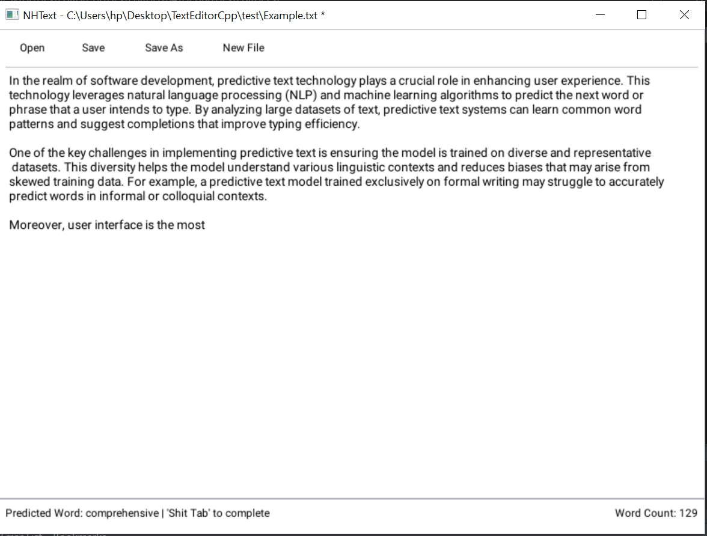

# TextEditorCpp (NHText) - Predictive Text Editor

NHText is a simple text editor application that features predictive text technology to enhance user experience. The predictive text system leverages natural language processing (NLP) and machine learning algorithms to suggest the next word or phrase as you type, improving typing efficiency and accuracy.

## Features

- **Predictive Text**: Automatically suggests the next word based on your typing.
- **Word Count**: Displays the current word count in the status bar.
- **File Operations**: Open, save, and create new text files with ease.
- **Customizable Interface**: Apply custom fonts and styles to enhance the user interface.

## Screenshot



## How to Use

1. **Open NHText**: Launch the application.
2. **Open a File**: Use the "Open" button to load a text file into the editor.
3. **Type and Edit**: Start typing or editing the text. The predictive text feature will suggest words as you type.
4. **Save Your Work**: Use the "Save" or "Save As" button to save your changes.
5. **Create New File**: Click "New File" to start a new text document.

## Installation

1. **Clone the Repository**:

   ```bash
   git clone https://github.com/nhunter0/TextEditorCpp.git
   cd nhtext
   ```

2. **Build the Project**:

   - Open the project in your preferred IDE (e.g., Visual Studio).
   - Build the solution to compile the application.

3. **Run the Application**:
   - Run the compiled executable from the build output directory.

## Contributing

Contributions are welcome! Please fork the repository and create a pull request with your changes.

## License

This project is licensed under the MIT License. See the [LICENSE](LICENSE) file for details.

## Acknowledgements

- **Dear ImGui**: For the user interface library.
